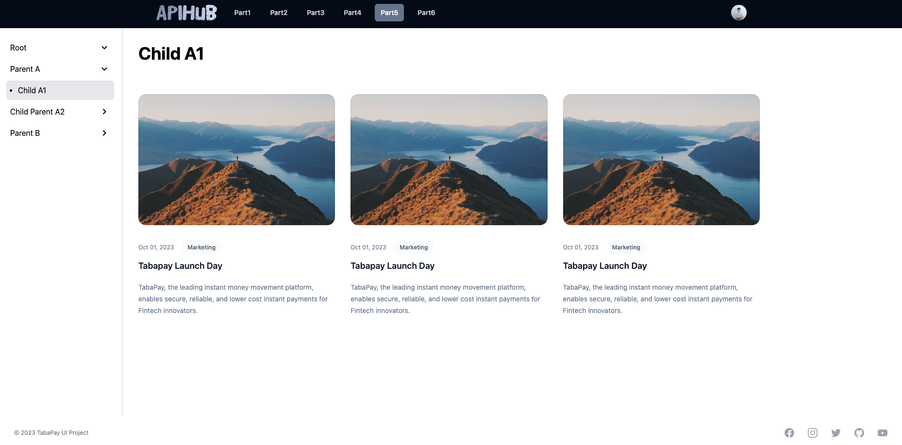
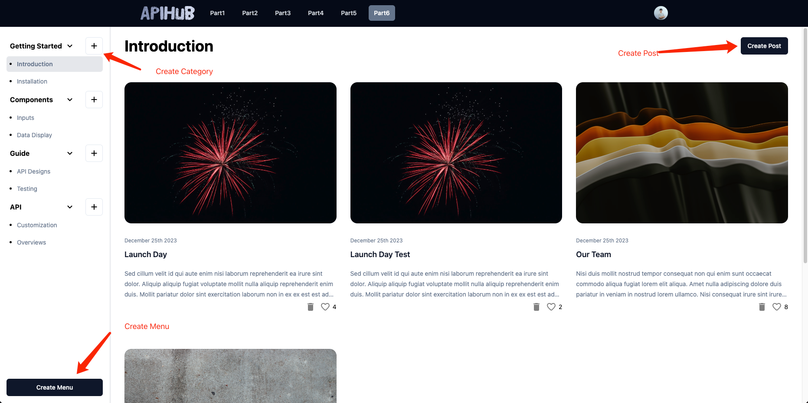
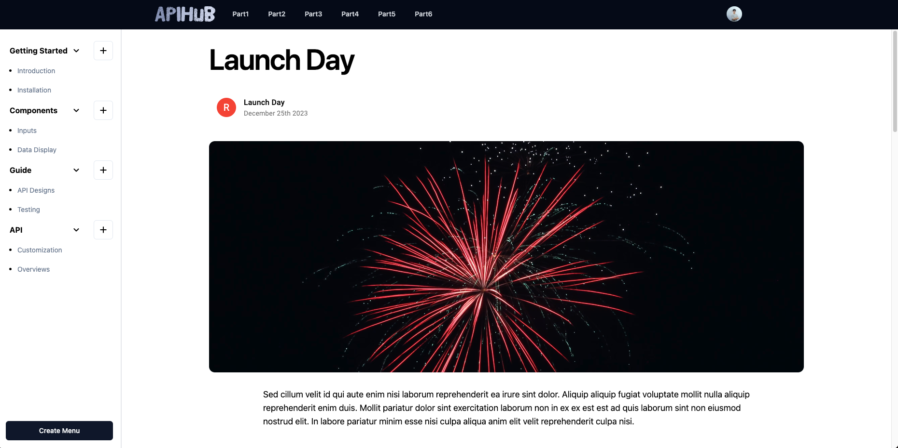

# TabaPay Developers UI Project

## Getting Started

First, run the development server:

```bash
npm install
npm run dev
```
visited http://localhost:5173/

## Deployment
#### I deploy the project to `Netlify`
⚠️ It may take a few seconds to load the page when you visit the site for the first time(just keep refreshing the page)

⚠️ If part6 didn't show the Menu, please open this url wait until the data show up: https://tabapay-ui-project-backend.onrender.com/api/post/Introduction

visited https://main--stellular-conkies-887058.netlify.app/


## Package

- React
- [Vite](https://vitejs.dev/)
- [TypeScript](https://www.typescriptlang.org/)
- [ESLint](https://eslint.org/)
  - [Airbnb style](https://github.com/airbnb/javascript)
- [Prettier](https://prettier.io/)
- [Material UI](https://material-ui.com/)
- [Tailwind CSS](https://tailwindcss.com/)
- [Shadcn/ui](https://ui.shadcn.com/)

## [Part 1](https://main--stellular-conkies-887058.netlify.app/part1)

### Objective

Create A Dynamic Tree Menu

### Approach

- [x] Create a tree menu component
- [x] Create TreeNode inside the tree menu component
- [x] Recursively render the tree node


## [Part 2](https://main--stellular-conkies-887058.netlify.app/part2)

### Objective: 

If Click on a Tree Item from Part 1, show which one was clicked? Using a Modal Dialog Box...

### Approach:

- [x] Create a Modal Dialog Box component
- [x] Create a state to store the clicked item
- [x] Pass the state to the Modal Dialog Box component
- [x] Show the Modal Dialog Box component when the item is clicked
- [x] Hide the Modal Dialog Box component when the close button/background is clicked


## [Part 3](https://main--stellular-conkies-887058.netlify.app/part3)

### Objective

- Add an Area to the right to Represent the clicked Tree Item
- Contents of the Body/Page should have a Title (Heading) of the Item Clicked...

### Approach

- [x] Create a component Body to show the clicked item
- [x] Pass the state to the Body component
- [x] Show the Body component when the item is clicked


## [Part 4](https://main--stellular-conkies-887058.netlify.app/part4)

### Objective

- Add a Header and Footer
- Add a Logo to the Left in the Header

### Approach

- [x] Create a component Header with a logo
- [x] Create a component Footer


## [Part 5](https://main--stellular-conkies-887058.netlify.app/part5)

### Objective

What if the Body / Page has a lot of data of different categories?

How would you visual origanize this Data?

Category 1
- Lots of Text

Category 2
- Lots of Text

Category 3
- Lots of Text

. . .

. . .

Category n
- Lots of Text

### Approach

- [x] For visual organization, I create a Card to show the data



## [Part 6 - For Full Stack Engineers](https://main--stellular-conkies-887058.netlify.app/part6)

### Objective

- Build a working prototype?
- Connecting the Front End (UI) with the Back End!

### Approach

- I decide to build a working prototype with Blog
- User can create Menu Item. With each Menu Item, user can create a Category and add a Post to the Category

### Implementation

- [x] For backend, I use `NodeJS` with `ExpressJS` and `MongoDB`
- [x] For State Management, I use `Context` to store the data of Menu Item, Category and Post
- [x] I put all the Service in `src/services` folder which include Typescript interface, Typescript type, API

### Images


#### Post Detail Page


